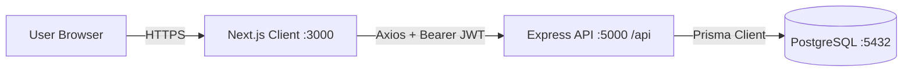
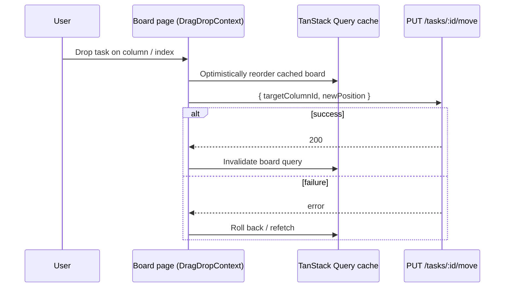
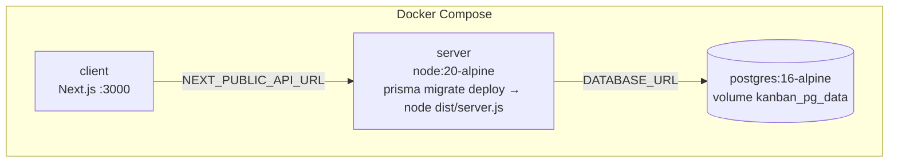

# System Architecture — Mini Kanban Board

## 1. Overview

A classic three-tier web application:

- **Presentation tier** — Next.js 14 (App Router) single-page style client
- **Application tier** — Node.js + Express REST API (TypeScript)
- **Data tier** — PostgreSQL 16 accessed through Prisma ORM



## 2. Technology Stack

| Layer            | Technology                                                                     |
| ---------------- | ------------------------------------------------------------------------------ |
| UI framework     | Next.js 14.2 (App Router), React 18                                            |
| Language         | TypeScript (client and server)                                                 |
| Styling          | Tailwind CSS 3                                                                 |
| Server state     | TanStack Query v5 (queries, mutations, cache invalidation, optimistic updates) |
| Drag and drop    | `@hello-pangea/dnd`                                                            |
| HTTP client      | Axios with request/response interceptors                                       |
| Notifications    | `react-toastify`                                                               |
| Icons            | `lucide-react`                                                                 |
| API              | Express 4, `cors`, `dotenv`                                                    |
| Auth             | `jsonwebtoken` (7-day tokens), `bcryptjs` (10 rounds)                          |
| ORM / migrations | Prisma 5.22                                                                    |
| Database         | PostgreSQL 16 (alpine image in Docker)                                         |
| Tooling          | `ts-node-dev` (dev), `tsc` (build), `tsx` (seed)                               |
| Containers       | Docker, Docker Compose                                                         |

## 3. Repository Structure

```
.
├── docker-compose.yml
├── docs/
├── client/
│   └── src/
│       ├── app/                 # routes: /, /login, /register, /boards, /boards/[id]
│       ├── components/          # Navbar, Modal, BoardCard, board/* (ColumnCard, TaskCard, TaskModal, ...)
│       ├── context/AuthContext  # session state (user, token, login/register/logout)
│       ├── hooks/               # useBoards, useColumns, useTasks (TanStack Query)
│       ├── lib/                 # axios instance, query-string helper, services/*
│       └── types/               # shared TypeScript interfaces
└── server/
    ├── server.ts                # process entry, app.listen
    └── src/
        ├── index.ts             # express app, CORS, route mounting, error handler
        ├── routes/              # auth, board, column, task routers
        ├── controllers/         # request handling + access checks + Prisma calls
        ├── middlewares/         # auth (JWT), errorHandler
        ├── utils/               # jwt, bcrypt helpers
        ├── config/prisma.ts     # PrismaClient singleton
        └── prisma/              # schema.prisma, migrations/, seed.ts
```

## 4. Frontend Architecture

### 4.1 Routing

| Route                 | Purpose                                            | Guard       |
| --------------------- | -------------------------------------------------- | ----------- |
| `/`                   | Landing page                                       | Public      |
| `/login`, `/register` | Authentication forms                               | Public      |
| `/boards`             | Board list with search and pagination (9 per page) | `AuthGuard` |
| `/boards/[id]`        | Board detail with columns, tasks, drag and drop    | `AuthGuard` |

### 4.2 Layers

1. **Pages / components** render UI and call hooks.
2. **Hooks** (`useBoards`, `useColumns`, `useTasks`) wrap TanStack Query. Each mutation shows a toast and invalidates the board detail query key.
3. **Services** (`*.service.ts`) hold plain Axios calls, one function per endpoint.
4. **`lib/axios.ts`** is the single Axios instance:
   - request interceptor adds `Authorization: Bearer <token>` from `localStorage`
   - response interceptor clears the session and redirects to `/login` on any 401 (except login)
5. **`AuthContext`** holds `user`, `token`, `isAuthenticated`, hydrates from `localStorage` (`kanban_token`, `kanban_user`) on mount and exposes `login`, `register`, `logout`.
6. **`AuthGuard`** redirects unauthenticated users to `/login` and wraps protected pages with the navbar.

### 4.3 Drag-and-drop flow



## 5. Backend Architecture

### 5.1 Request pipeline

```
Request → CORS → express.json() → Router → auth middleware (protected routes)
        → Controller (validate, check access, Prisma) → JSON response
                                                      └─ unhandled → errorHandler (500)
```

### 5.2 Layers

| Layer                             | Responsibility                                                                                  |
| --------------------------------- | ----------------------------------------------------------------------------------------------- |
| `routes/*`                        | Map HTTP verb + path to a controller; attach `auth` middleware                                  |
| `middlewares/auth.ts`             | Read `Authorization: Bearer`, verify JWT, set `req.user = { id, email }`                        |
| `controllers/*`                   | Input checks, authorisation (owner / member), Prisma queries and transactions, response shaping |
| `utils/jwt.ts`, `utils/bcrypt.ts` | Token and password helpers                                                                      |
| `config/prisma.ts`                | Shared `PrismaClient`                                                                           |
| `middlewares/errorHandler.ts`     | Final 500 handler returning `{ success:false, message }`                                        |

### 5.3 Authorisation model

There is no separate permission table. Access is derived from the data:

- **Has access** = `board.ownerId === userId` **or** a `BoardMember` row exists for `(boardId, userId)`.
- **Owner-only** actions: rename board, delete board, share board, remove member.
- Column and task endpoints resolve the board through the column/task and apply the same access check.
- Single-board lookups return 404 when the user has no access, so the existence of other users' boards is not revealed.

### 5.4 Task ordering algorithm

Tasks are ordered by an integer `position` per column, kept dense (`0..n-1`). Columns use the same idea with `order`.

- **Create:** `position = last.position + 1` (or `0`).
- **Move within a column** (valid `newPosition`: `0..n-1`), inside one transaction:
  - moving down (`old < new`): tasks with `old < position <= new` get `-1`
  - moving up (`old > new`): tasks with `new <= position < old` get `+1`
  - then the task's position is set to `new`
- **Move to another column** (valid `newPosition`: `0..n` of target), inside one transaction:
  - source column: tasks with `position > old` get `-1`
  - target column: tasks with `position >= new` get `+1`
  - task gets `columnId = target`, `position = new`

### 5.5 Cascading deletes

Foreign keys use `ON DELETE RESTRICT`, so the API deletes children explicitly inside transactions:

- delete column → tasks of the column, then the column
- delete board → tasks of all its columns, columns, memberships, then the board

## 6. Deployment Architecture



| Service    | Image / build         | Port | Notes                                                     |
| ---------- | --------------------- | ---- | --------------------------------------------------------- |
| `postgres` | `postgres:16-alpine`  | 5432 | Healthcheck `pg_isready`; data in volume `kanban_pg_data` |
| `server`   | `./server/Dockerfile` | 5000 | Waits for healthy DB; runs migrations on boot             |
| `client`   | `./client/Dockerfile` | 3000 | `NEXT_PUBLIC_API_URL` is a build arg and a runtime env    |

### 6.1 Configuration

| Where               | Variable              | Purpose                                                       |
| ------------------- | --------------------- | ------------------------------------------------------------- |
| `server/.env`       | `PORT`                | API port (default 5000)                                       |
| `server/.env`       | `DATABASE_URL`        | PostgreSQL connection string                                  |
| `server/.env`       | `JWT_SECRET`          | Token signing secret                                          |
| `client/.env.local` | `NEXT_PUBLIC_API_URL` | API base URL, must end with `/api` and have no trailing slash |

The frontend is also deployed separately in the allow-list (Netlify) and the API on Render; CORS in `server/src/index.ts` allows those origins, `http://localhost:3000`, and GitHub Codespaces URLs matching `https://*-3000.app.github.dev`.

## 7. Security Considerations

| Area             | Current implementation                                | Possible improvement                                |
| ---------------- | ----------------------------------------------------- | --------------------------------------------------- |
| Passwords        | bcrypt, 10 rounds                                     | Enforce password policy                             |
| Tokens           | JWT, 7 days, stored in `localStorage`                 | httpOnly cookie + refresh token; shorter expiry     |
| Secrets          | Env vars; Compose has a fallback default `JWT_SECRET` | Require a secret in production, no default          |
| Input validation | Light, per controller                                 | Schema validation (e.g. Zod) for all bodies/queries |
| Rate limiting    | None                                                  | Rate-limit `/auth/*`                                |
| Error handling   | Generic 500 messages                                  | Central typed errors, structured logging            |
| Access control   | Owner/member check on every board-scoped call         | Role levels (viewer/editor)                         |

## 8. Known Limitations and Future Work

- No real-time updates (changes from other users appear after refetch); WebSockets/SSE would add this.
- No endpoint to reorder columns (order is fixed at creation).
- Ownership transfer, member roles, task comments, labels and due dates are not implemented.
- `GET /columns` and `GET /tasks` exist in the API but the UI uses the board detail endpoint for rendering.
